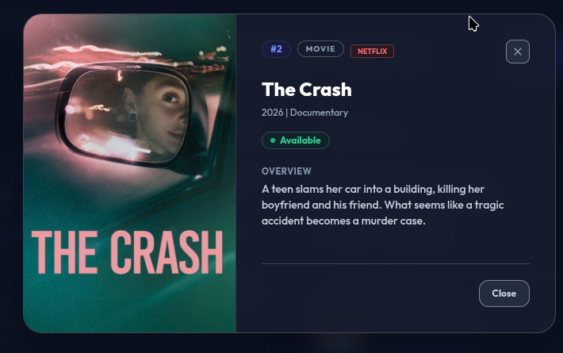

# 🎬 Top10 to Seerr

[](https://www.docker.com/)
[](https://flask.palletsprojects.com/)
[](https://tailwindcss.com/)
[](https://overseerr.dev/)

**Top10 to Seerr** is a premium, full-stack, single-page web application designed to automatically track popular trending charts across **6 major streaming platforms** (Netflix, Amazon Prime Video, Disney+, HBO Max, Apple TV+, Paramount+) supporting **100+ countries** and global charts. It cross-references trending lists against your local **Overseerr/Seerr** library, allowing users to bulk-request missing media in a single click.

It features a premium, glassmorphic dark slate/indigo UI with horizontal streaming platform navigation tabs, live vector country flag comboboxes, a dedicated active background automation banner, interactive full-card click selections, self-healing poster image proxying, and a hybrid 48-hour background automation worker.

---

## 📸 Screenshots

| Dashboard Home Overview | Interactive Media Details Popup |
| :---: | :---: |
|  |  |

---

## ✨ Key Features

* **🌟 Multi-Platform Scraper Integration:** Supports 6 major platforms: Netflix, Amazon Prime Video, Disney+, HBO Max, Apple TV+, and Paramount+, leveraging exact FlixPatrol slug schemas.
* **🌍 100+ Countries & Global Lists:** Dropdown selector populated with countries dynamically (using vector flags from `flagcdn`) alongside global charts.
* **⚡ Searchable Country Combobox:** Filter countries effortlessly. The input leading icon dynamically changes to the country's flag (or a spinning globe for global lists) on selection.
* **🤖 Premium Dedicated Auto-Sync Banner:** A dedicated glassmorphic status banner directly beneath the Controls card displaying active background sync subscription status (with overlapping platform emblems and country flags).
* **🎬 Flexible Automated Sync:** Easily select which media types to sync automatically (`🎬 Movies Only`, `📺 Shows Only`, or `🌟 Both`) and update or switch configurations instantly.
* **🛡️ Deep Duplicate Request Protection:** Automatically crawls Overseerr's database, inspecting media states to disable request operations for titles that are already **Available**, **Processing**, **Pending Request**, or admin-**Declined**.
* **🚀 Self-Healing Poster Proxying:** Solves the notorious Overseerr `/api/v1/imageproxy` authentication wall. Flask automatically attempts to fetch posters using Seerr API credentials; if that fails or is misconfigured, the backend **automatically extracts the raw TMDB CDN link, downloads it directly, and streams the image to the browser**, ensuring 100% poster visibility!
* **🧠 Title Normalization:** Strips platform series and season descriptors (e.g., converting `"The Boroughs: Season 1"` to `"The Boroughs"`), boosting TMDB search match accuracy to **near 100%**.
* **🖱️ Full-Card Selection & `:has()` Styling:** Select items by clicking anywhere on a media card. Utilizes CSS `:has()` styling to render beautiful glowing borders and subtle gradient transformations on checked cards.
* **⚙️ Dynamic Configuration Drawer:** Change Overseerr URLs or credentials on the fly via a slide-out settings panel. Variables are written to the `.env` file and hot-reloaded instantly in Flask memory with zero server restarts.
* **🐳 Dockerized Deployment:** Easily package and run the application as a lightweight container served on port **8562**.

---

## 🛠️ Docker & Docker Compose Setup (Recommended)

Running the application with Docker or Docker Compose is the easiest and most robust method. It keeps your system clean and isolates dependencies.

### Prerequisites
Make sure you have [Docker](https://www.docker.com/) and [Docker Compose](https://docs.docker.com/compose/) installed on your machine.

### Method A: Instant Setup (Pre-built Image)
If you just want to run the application, you only need a single file: `docker-compose.yml`.

1. **Create a `docker-compose.yml` file** on your machine:
   ```yaml
   services:
     top10-seerr:
       image: ghcr.io/therealodineye/top10-seerr:latest
       container_name: top10-seerr
       ports:
         - "8562:5000"
       volumes:
         # Mounts local .env file to persist configurations entered in the UI settings drawer
         - ./.env:/app/.env
       restart: unless-stopped
   ```

2. **Pre-create an empty `.env` file** in the same directory:
   ```bash
   touch .env
   ```
   > [!IMPORTANT]
   > You must create the `.env` file *before* starting the docker container so that Docker Compose mounts a file rather than creating an empty directory on the host.

3. **Start the application:**
   ```bash
   docker compose up -d
   ```

4. **Access the Web App:** Open your browser and navigate to: **[http://localhost:8562](http://localhost:8562)**

---

### Method B: Clone & Build Locally
If you prefer to compile and build the container image yourself from the source code:

1. **Clone the Repository** and enter the folder:
   ```bash
   git clone https://github.com/therealodineye/top10-seerr.git
   cd top10-seerr
   ```

2. **Prepare the environment file:**
   ```bash
   cp .env.example .env
   ```
   > [!IMPORTANT]
   > Create the `.env` file *before* running compose to prevent Docker from mounting it as a folder.

3. **Start the application** (it will compile locally using the local `Dockerfile`):
   ```bash
   docker compose up -d
   ```

4. **Access the Web App:** Open your browser and navigate to: **[http://localhost:8562](http://localhost:8562)**

---

## 📦 Direct Python Setup (Local Development)

If you wish to run the Flask application directly on your local system without Docker:

### Prerequisites
* Python 3.10 or higher
* `pip` package manager

### Steps
1. **Clone & Enter Folder:**
   ```bash
   git clone https://github.com/therealodineye/top10-seerr.git
   cd top10-seerr
   ```

2. **Set Up Virtual Environment:**
   ```bash
   python -m venv .venv
   source .venv/bin/activate  # On Windows, use `.venv\Scripts\activate`
   ```

3. **Install Dependencies:**
   ```bash
   pip install -r requirements.txt
   ```

4. **Launch the Server:**
   ```bash
   python app.py
   ```
   The development server will boot and be accessible at: **[http://127.0.0.1:5000](http://127.0.0.1:5000)**.

---

## 🛡️ Request Approval & Dedicated Bot User (Recommended)

To ensure that media requests made through this application are **not automatically approved** (keeping you in complete control of what actually gets downloaded by Radarr/Sonarr), it is highly recommended to set up a dedicated low-permission "bot user" in Overseerr:

1. **Create the Bot User in Seerr:**
   * Go to **Overseerr/Seerr** → **Users** → **Add User**.
   * Create a local account with a unique email and password (e.g., `seerrsync-bot@local.domain`).
   * **Do not grant any Auto-Approve permissions** to this user.
   * Note the email and password—you will enter them in the application settings drawer!

2. **How it Works:**
   * When you submit requests, the web app authenticates as this dedicated low-permission bot account.
   * The requests will be successfully submitted to Overseerr and put into the **Pending approval** queue rather than auto-importing immediately. This allows administrators to review and approve downloads individually!

---

## ⚙️ Configuration Variables

The application can write its variables dynamically from the UI's slide-out settings drawer. Alternatively, you can configure them directly in your `.env` file:

| Variable | Description | Example |
| :--- | :--- | :--- |
| `SEERR_URL` | The base URL of your Overseerr/Seerr server (with trailing slash) | `https://seerr.mydomain.com/` |
| `SEERR_API_KEY` | Your Overseerr API Key (found in *Settings -> General*) | `MTc3MT...==` |
| `SEERR_EMAIL` | The admin/user email address used to log into Overseerr | `admin@domain.com` |
| `SEERR_PASSWORD` | The password associated with the Overseerr email | `my_password` |
| `AUTOMATION_ENABLED` | Enable background pinned list sync automation (`true` / `false`) | `false` |
| `AUTOMATION_PLATFORM` | Platform slug for automation: netflix, amazon-prime, disney, hbo-max, apple-tv, paramount-plus | `netflix` |
| `AUTOMATION_COUNTRY` | Country slug for automation (e.g. world, norway, united-states, etc. matching flixpatrol slugs) | `world` |
| `AUTOMATION_MEDIA_TYPE` | Media type to automatically sync background pinned lists (`both`, `movie`, `tv`) | `both` |

---

## 📜 License

This project is licensed under the MIT License. See the `LICENSE` file for details.

---

### IMPORTANT NOTICE
Only for educational purposes, make sure you have the rights to download any media on the internet.
